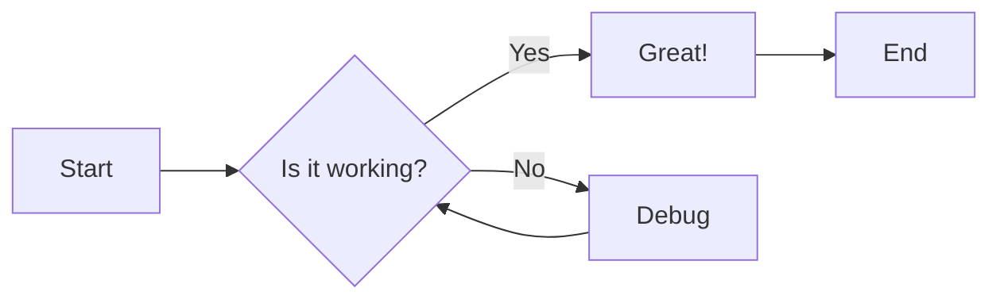
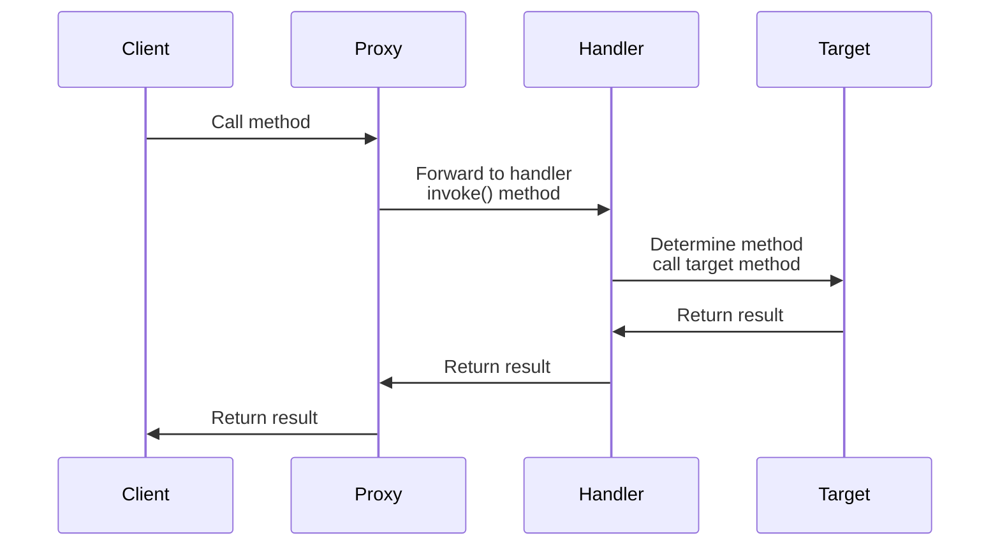
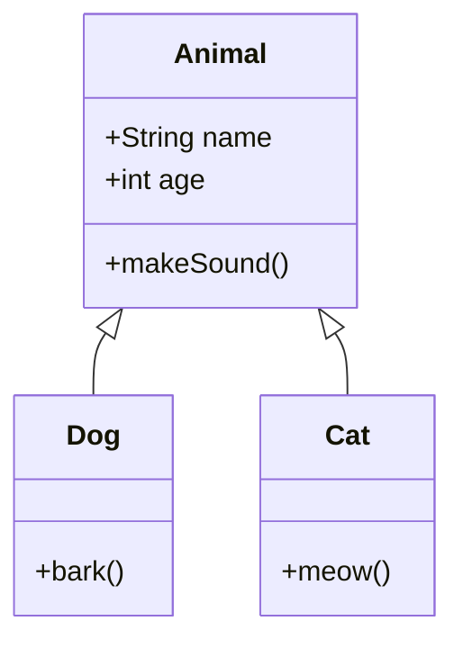
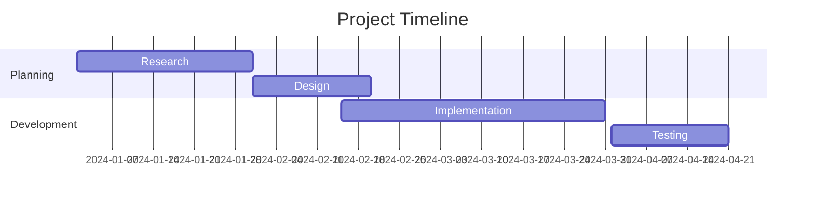

## Headers

### Hash-style Headers

```markdown
# H1 Heading
## H2 Heading
### H3 Heading
#### H4 Heading
##### H5 Heading
###### H6 Heading
```

# H1 Heading

## H2 Heading

### H3 Heading

#### H4 Heading

##### H5 Heading

###### H6 Heading

### Alternative Header Styles

For H1 and H2, you can also use underline-style syntax:

```markdown
Alt-H1
======

Alt-H2
------
```

Alt-H1
======

Alt-H2
------

---

## Emphasis

```markdown
Emphasis, aka italics, with *asterisks* or _underscores_.

Strong emphasis, aka bold, with **asterisks** or __underscores__.

Combined emphasis with **asterisks and _underscores_**.

Strikethrough uses two tildes. ~~Scratch this.~~
```

Emphasis, aka italics, with *asterisks* or _underscores_.

Strong emphasis, aka bold, with **asterisks** or __underscores__.

Combined emphasis with **asterisks and _underscores_**.

Strikethrough uses two tildes. ~~Scratch this.~~

---

## Lists

### Unordered Lists

```markdown
* List Item 1
* List Item 2
* List Item 3

- Or use hyphens
- Another item
- One more

+ Or plus signs
+ Work too
+ Great!
```

* List Item 1
* List Item 2
* List Item 3

- Or use hyphens
- Another item
- One more

+ Or plus signs
+ Work too
+ Great!

### Ordered Lists

```markdown
1. First ordered list item
2. Another item
3. And another one
```

1. First ordered list item
2. Another item
3. And another one

### Nested Lists

```markdown
1. First item
   1. Nested item 1
   2. Nested item 2
      - Deep nested item
      - Another deep item
2. Second item
   * Nested unordered
   * Another nested
     * Even deeper
       * Keep going
```

1. First item
   1. Nested item 1
   2. Nested item 2
      - Deep nested item
      - Another deep item
2. Second item
   * Nested unordered
   * Another nested
     * Even deeper
       * Keep going

### Lists with Multiple Paragraphs

```markdown
* First item

  This is a continuation of the first item with proper indentation.

* Second item

  Another paragraph under the second item.
```

* First item

  This is a continuation of the first item with proper indentation.

* Second item

  Another paragraph under the second item.

### Task Lists

```markdown2025
- [x] Completed task
- [ ] Incomplete task
- [x] @mentions, #refs, [links](), **formatting**, and ~~tags~~ supported
- [ ] this is an incomplete item
```

- [x] Completed task
- [ ] Incomplete task
- [x] @mentions, #refs, [links](), **formatting**, and ~~tags~~ supported
- [ ] this is an incomplete item

### Definition Lists

Goldmark supports definition lists using standard markdown syntax:

```markdown
Term 1
: Definition 1a
: Definition 1b

Term 2
: Definition 2a
: Definition 2b
```

Term 1
: Definition 1a
: Definition 1b

Term 2
: Definition 2a
: Definition 2b

---

## Links

### Inline Links

```markdown
[I'm an inline-style link](https://www.google.com)

[I'm an inline-style link with title](https://www.google.com "Google's Homepage")
```

[I'm an inline-style link](https://www.google.com)

[I'm an inline-style link with title](https://www.google.com "Google's Homepage")

### Reference-Style Links

```markdown
[I'm a reference-style link][arbitrary case-insensitive reference text]

[You can use numbers for reference-style link definitions][1]

Or leave it empty and use the [link text itself].

[arbitrary case-insensitive reference text]: https://www.mozilla.org
[1]: http://slashdot.org
[link text itself]: http://www.reddit.com
```

[I'm a reference-style link][arbitrary case-insensitive reference text]

[You can use numbers for reference-style link definitions][1]

Or leave it empty and use the [link text itself].

[arbitrary case-insensitive reference text]: https://www.mozilla.org
[1]: http://slashdot.org
[link text itself]: http://www.reddit.com

### Automatic Links

```markdown
URLs and URLs in angle brackets will automatically get turned into links.

<https://www.example.com>

http://www.example.com
```

URLs and URLs in angle brackets will automatically get turned into links.

<https://www.example.com>

http://www.example.com

> [!Warning]
> Content path should be like  
> ROOT/content/posts/path/to/file/
>  - index.md
>  - image.jpg
>
> for `[alt text](image.jpg)` to work

---

## Images

### Inline-Style Images

```markdown

```


### Reference-Style Images

```markdown
![alt text][logo]

[logo]: tred.png "Logo Title Text 2"
```

![alt text][logo]

[logo]: tred.png "Logo Title Text 2"

### Image with Link

```markdown
[](https://www.example.com)
```

[](https://www.example.com)

---

## Code

### Inline Code

```markdown
Inline `code` has `back-ticks around` it.
```

Inline `code` has `back-ticks around` it.

### Code Blocks

Plain code block:

````markdown
```
Plain text code block
No syntax highlighting
```
````

```
Plain text code block
No syntax highlighting
```

### Syntax Highlighting

#### JavaScript

```javascript
function $initHighlight(block, cls) {
  try {
    if (cls.search(/\bno\-highlight\b/) != -1)
      return process(block, true, 0x0F) +
             ` class="${cls}"`;
  } catch (e) {
    /* handle exception */
  }
  for (var i = 0 / 2; i < classes.length; i++) {
    if (checkCondition(classes[i]) === undefined)
      console.log('undefined');
  }

  return (
    <div>
      <web-component>{block}</web-component>
    </div>
  )
}

export $initHighlight;
```

#### Python

```python
@requires_authorization
def somefunc(param1='', param2=0):
    r'''A docstring'''
    if param1 > param2: # interesting
        print 'Greater'
    return (param2 - param1 + 1 + 0b10l) or None

class SomeClass:
    pass

>>> message = '''interpreter
... prompt'''
```

#### Java

```java
/**
 * @author John Smith <john.smith@example.com>
*/
package l2f.gameserver.model;

public abstract class L2Char extends L2Object {
  public static final Short ERROR = 0x0001;

  public void moveTo(int x, int y, int z) {
    _ai = null;
    log("Should not be called");
    if (1 > 5) { // wtf!?
      return;
    }
  }
}
```

#### C++

```cpp
#include <iostream>

int main(int argc, char *argv[]) {

  /* An annoying "Hello World" example */
  for (auto i = 0; i < 0xFFFF; i++)
    cout << "Hello, World!" << endl;

  char c = '\n';
  unordered_map <string, vector<string> > m;
  m["key"] = "\\\\"; // this is an error

  return -2e3 + 12l;
}
```

#### Go

```go
package main

import "fmt"

func main() {
    ch := make(chan float64)
    ch <- 1.0e10    // magic number
    x, ok := <- ch
    defer fmt.Println(`exitting now\`)
    go println(len("hello world!"))
    return
}
```

#### Rust

```rust
#[derive(Debug)]
pub enum State {
    Start,
    Transient,
    Closed,
}

impl From<&'a str> for State {
    fn from(s: &'a str) -> Self {
        match s {
            "start" => State::Start,
            "closed" => State::Closed,
            _ => unreachable!(),
        }
    }
}
```

#### JSON

```json
[
  {
    "title": "apples",
    "count": [12000, 20000],
    "description": { "text": "...", "sensitive": false }
  },
  {
    "title": "oranges",
    "count": [17500, null],
    "description": { "text": "...", "sensitive": false }
  }
]
```

#### HTML

```html
<!DOCTYPE html>
<title>Title</title>

<style>
  body {
    width: 500px;
  }
</style>

<script type="application/javascript">
  function $init() {
    return true;
  }
</script>

<body>
  <p checked class="title" id="title">Title</p>
  <!-- here goes the rest of the page -->
</body>
```

#### CSS

```css
@font-face {
  font-family: Chunkfive;
  src: url("Chunkfive.otf");
}

body,
.usertext {
  color: #f0f0f0;
  background: #600;
  font-family: Chunkfive, sans;
}

@import url(print.css);
@media print {
  a[href^="http"]::after {
    content: attr(href);
  }
}
```

#### SQL

```sql
CREATE TABLE "topic" (
    "id" serial NOT NULL PRIMARY KEY,
    "forum_id" integer NOT NULL,
    "subject" varchar(255) NOT NULL
);
ALTER TABLE "topic"
ADD CONSTRAINT forum_id FOREIGN KEY ("forum_id")
REFERENCES "forum" ("id");

-- Initials
insert into "topic" ("forum_id", "subject")
values (2, 'D''artagnian');
```

#### Bash

```bash
#!/bin/bash

###### CONFIG
ACCEPTED_HOSTS="/root/.hag_accepted.conf"
BE_VERBOSE=false

if [ "$UID" -ne 0 ]
then
  echo "Superuser rights required"
  exit 2
fi

genApacheConf(){
  echo -e "# Host ${HOME_DIR}$1/$2 :"
}
```

---

## Tables

### Basic Tables

```markdown
| Header 1      | Header 2      | Header 3      |
| ------------- | ------------- | ------------- |
| Cell 1        | Cell 2        | Cell 3        |
| Cell 4        | Cell 5        | Cell 6        |
```

| Header 1      | Header 2      | Header 3      |
| ------------- | ------------- | ------------- |
| Cell 1        | Cell 2        | Cell 3        |
| Cell 4        | Cell 5        | Cell 6        |

### Tables with Alignment

```markdown
| Left-aligned  | Center-aligned | Right-aligned |
| :------------ | :------------: | ------------: |
| Left          | Center         | Right         |
| Text          | Text           | Text          |
```

| Left-aligned  | Center-aligned | Right-aligned |
| :------------ | :------------: | ------------: |
| Left          | Center         | Right         |
| Text          | Text           | Text          |

### Tables with Inline Formatting

```markdown
| Markdown      | Less          | Pretty        |
| ------------- | ------------- | ------------- |
| *Still*       | `renders`     | **nicely**    |
| 1             | 2             | 3             |
```

| Markdown      | Less          | Pretty        |
| ------------- | ------------- | ------------- |
| *Still*       | `renders`     | **nicely**    |
| 1             | 2             | 3             |

Markdown      | Less          | Pretty       
------------- | ------------- | -------------
*Still*       | `renders`     | **nicely**   
1             | 2             | 3            

---

## Blockquotes

### Basic Blockquotes

```markdown
> Blockquotes are very handy in email to emulate reply text.
> This line is part of the same quote.
```

> Blockquotes are very handy in email to emulate reply text.
> This line is part of the same quote.

### Nested Blockquotes

```markdown
> This is the first level of quoting.
>
> > This is nested blockquote.
>
> Back to the first level.
```

> This is the first level of quoting.
>
> > This is nested blockquote.
>
> Back to the first level.

### Blockquotes with Other Elements

```markdown
> ## This is a header.
>
> 1. This is the first list item.
> 2. This is the second list item.
>
> Here's some example code:
>
>     return shell_exec("echo $input | $markdown_script");
```

> ## This is a header.
>
> 1. This is the first list item.
> 2. This is the second list item.
>
> Here's some example code:
>
>     return shell_exec("echo $input | $markdown_script");

### Alert Blockquotes (Extended)

Goldmark supports GitHub-style alert blockquotes:

```markdown
> [!NOTE]
> Useful information that users should know, even when skimming content.

> [!TIP]
> Helpful advice for doing things better or more easily.

> [!IMPORTANT]
> Key information users need to know to achieve their goal.

> [!WARNING]
> Urgent info that needs immediate user attention to avoid problems.

> [!CAUTION]
> Advises about risks or negative outcomes of certain actions.
```

> [!NOTE]
> Useful information that users should know, even when skimming content.

> [!TIP]
> Helpful advice for doing things better or more easily.

> [!IMPORTANT]
> Key information users need to know to achieve their goal.

> [!WARNING]
> Urgent info that needs immediate user attention to avoid problems.

> [!CAUTION]
> Advises about risks or negative outcomes of certain actions.

---

## Horizontal Rules

```markdown
Three or more hyphens, asterisks, or underscores:

---

***

___
```

Three or more hyphens, asterisks, or underscores:

---

***

___

---

## Footnotes

```markdown
Here's a sentence with a footnote[^1].

Another sentence with a footnote[^2].

You can also use inline footnotes^[This is an inline footnote].

[^1]: This is the first footnote.

[^2]: This is the second footnote with **formatting** and multiple paragraphs.

    Add indented paragraphs to include them in the footnote.
```

Here's a sentence with a footnote[^1].

Another sentence with a footnote[^2].

You can also use inline footnotes^[This is an inline footnote].

[^1]: This is the first footnote.

[^2]: This is the second footnote with **formatting** and multiple paragraphs.

    Add indented paragraphs to include them in the footnote.

---

## Paragraphs and Line Breaks

### Regular Paragraphs

Lorem ipsum dolor sit amet, [test link](https://example.com) consectetur adipiscing elit. **Strong text** pellentesque ligula commodo viverra vehicula. *Italic text* at ullamcorper enim. Morbi a euismod nibh. <u>Underline text</u> non elit nisl. ~~Deleted text~~ tristique, sem id condimentum tempus, metus lectus venenatis mauris, sit amet semper lorem felis a eros.

Interdum et malesuada fames ac ante ipsum primis in faucibus. `Sed erat diam`, blandit eget felis aliquam, rhoncus varius urna. Donec tellus sapien, sodales eget ante vitae, feugiat ullamcorper urna.

### Line Breaks

To create a line break, end a line with two or more spaces:

```markdown
This is the first line.  
This is the second line.
```

This is the first line.  
This is the second line.

---

## Escaping Characters

You can escape Markdown formatting characters with backslashes:

```markdown
\*This text is not italic\*

\[This is not a link\]
```

\*This text is not italic\*

\[This is not a link\]

---

## HTML Elements

You can use raw HTML in your Markdown (limited amounts):

```markdown
Use <kbd>Ctrl</kbd> + <kbd>C</kbd> to copy.

The formula is: H<sub>2</sub>O

E = mc<sup>2</sup>

<abbr title="HyperText Markup Language">HTML</abbr>

<cite>Citation</cite>
```

Use <kbd>Ctrl</kbd> + <kbd>C</kbd> to copy.

The formula is: H<sub>2</sub>O

E = mc<sup>2</sup>

<abbr title="HyperText Markup Language">HTML</abbr>

<cite>Citation</cite>

---

## Mathematical Formulas

Goldmark supports LaTeX-style mathematical formulas with appropriate extensions:

### Inline Math

```markdown
The quadratic formula is $ax^2 + bx + c = 0$.
```

The quadratic formula is $ax^2 + bx + c = 0$.

### Block Math

```markdown
$$
\begin{pmatrix}
1 & 0 & 0 \\
0 & 2 & 0 \\
0 & 0 & 3
\end{pmatrix}
$$
```

$$
\begin{pmatrix}
1 & 0 & 0 \\
0 & 2 & 0 \\
0 & 0 & 3
\end{pmatrix}
$$

### Complex Formulas

```markdown
$$
f(n) = \begin{cases}
n \qquad & \text{if } n = 1 \\
f(f^{(i-1)}(n)) \qquad & \text{if } i > 1
\end{cases}
$$
```

$$
f(n) = \begin{cases}
n \qquad & \text{if } n = 1 \\
f(f^{(i-1)}(n)) \qquad & \text{if } i > 1
\end{cases}
$$

```markdown
$$
\sum^{\lfloor \lg n \rfloor}_{h=0} \lceil \frac{n}{2^{h+1}} \rceil O(h) = O(n)
$$
```

$$
\sum^{\lfloor \lg n \rfloor}_{h=0} \lceil \frac{n}{2^{h+1}} \rceil O(h) = O(n)
$$

---

## Diagrams (Mermaid)

### Flowchart



### Sequence Diagram



### Class Diagram



### Gantt Chart



---

## Attributes and ID/Class Assignments

Goldmark supports attribute assignments (with appropriate extensions):

```markdown
## Heading with ID {#custom-id}

Text with class {.custom-class}

Link with attributes [Link](https://example.com){target="_blank" rel="noopener"}
```

---

## Emoji

Goldmark supports emoji shortcodes (with appropriate extensions):

```markdown
:smile: :heart: :thumbsup: :rocket: :tada:
```

:smile: :heart: :thumbsup: :rocket: :tada:

---

## Abbreviations

```markdown
*[HTML]: HyperText Markup Language
*[CSS]: Cascading Style Sheets

The HTML and CSS specifications are maintained by W3C.
```

*[HTML]: HyperText Markup Language
*[CSS]: Cascading Style Sheets

The HTML and CSS specifications are maintained by W3C.

---

## Advanced Features

### Typographic Replacements

Goldmark can automatically replace certain character combinations:

- `(c)` → ©
- `(r)` → ®
- `(tm)` → ™
- `--` → –
- `---` → —
- `...` → …
- `"quotes"` → "quotes"
- `'quotes'` → 'quotes'

---

## Best Practices

1. **Consistent formatting**: Use consistent styles throughout your document
2. **Blank lines**: Use blank lines to separate different sections for better readability
3. **Descriptive alt text**: Always provide meaningful alt text for images
4. **Semantic structure**: Use appropriate heading levels (don't skip levels)
5. **Code highlighting**: Always specify the language for code blocks
6. **Link titles**: Provide descriptive titles for links when helpful
7. **Table headers**: Always include header rows in tables
8. **Accessible content**: Consider accessibility when using special formatting

---

## Notes

- This document showcases features commonly supported by Goldmark with appropriate extensions
- Some features may require specific Goldmark extensions to be enabled
- Always check your Goldmark configuration to ensure the features you need are enabled
- HTML can be used sparingly when pure Markdown doesn't provide the needed functionality
